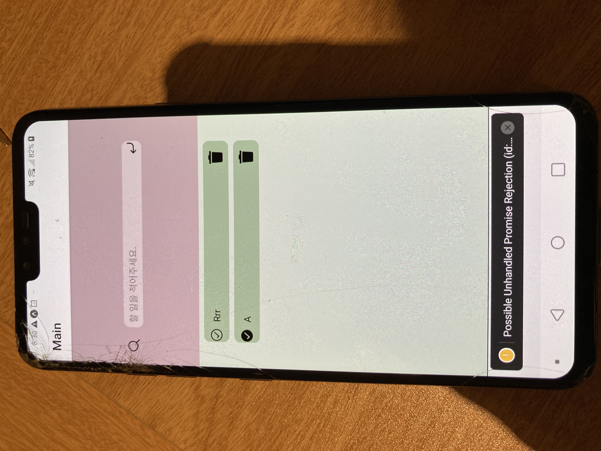

# React-Native , node.js, mongoDB 를 이용한 TODO App
영상보기(사진클릭)

## 기술스택
1. 언어
   - javaScript
2. Client
   - React-Native
   - context API
   - axios
   - reducer
3. Server
   - node.js
   - express
   - mongoose
4. DB
   - MongoDB